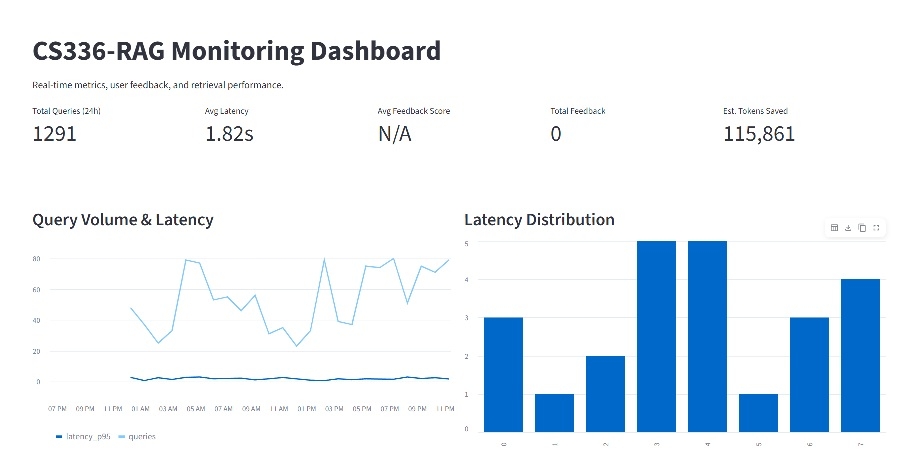

# CS336-RAG

**Course: DataTalks LLM Zoomcamp 2026**

A RAG application that answers questions about Stanford's CS336 course
(Language Modeling from Scratch). Searches lecture transcripts and code
from the course GitHub repo using an in-memory search index — no external
database required.

## Problem

Stanford CS336 has 19 lectures on YouTube and a lot of code on GitHub.
Finding a specific topic means scrubbing through hours of video or reading
hundreds of files. This app lets you ask questions in natural language and
get answers with citations to the exact video timestamp or file.

**Course:** [Stanford CS336](https://cs336.stanford.edu/) (Spring 2026)
**Playlist:** https://www.youtube.com/watch?v=JuoVZkPBiKk&list=PLoROMvodv4rMqXOcazWaTUHhq-yembLCV
**GitHub:** https://github.com/stanford-cs336/lectures

## Features

- **Natural-language questions** about CS336 lectures and code
- **Cited answers** — links to the exact YouTube timestamp or GitHub file
- **Hybrid search** (TF-IDF + embeddings, fused with RRF)
- **Cross-encoder reranking** for more relevant top results
- **Query rewriting** with synonyms for better retrieval
- **Streamlit chat UI** with rewrite/rerank toggles and top-k control
- **Monitoring dashboard** — 8 charts fed by real usage logs
- **Evaluation** — Hit Rate/MRR for retrieval, LLM-as-a-Judge for answers

## Dataset

| Source | Content |
|--------|---------|
| YouTube lectures 1-3 | Overview & Tokenization (Percy), PyTorch & Resource Accounting (Percy), Architectures & Hyperparameters (Tatsu) — 477 timestamped segments |
| GitHub: stanford-cs336/assignment1-basics | Student assignment code — BPE tokenizer, transformer implementation, training loop (3,263 chunks) |

**Total: 3,740 chunks**

## How it works

Ask a question → LLM rewrites it → Hybrid search (TF-IDF + vector embeddings → RRF fusion) → Cross-encoder reranking → LLM (prompted as a Stanford CS336 professor) generates a cited answer.

## Quickstart

```bash
# 1. Set up your API key
cp .env.example .env
# Edit .env: choose LLM_PROVIDER=opencode (DeepSeek V4 Flash) or openai (GPT-4o-mini)
# and add the matching key: OPENCODE_API_KEY or OPENAI_API_KEY

# 2. Install dependencies
pip install -r requirements.txt

# 3. Fetch and index data
python ingest.py

# 4. Start the chat UI
streamlit run app.py

# 5. Monitoring dashboard
streamlit run dashboard.py

# Or with Docker Compose (app + dashboard)
docker compose up -d
```

## Testing

```bash
# Search without LLM
python search.py "How does BPE tokenization work?"

# Full RAG pipeline
python ask.py "What is the Chinchilla scaling law?"

# Retrieval evaluation (Hit Rate + MRR)
python eval.py

# RAG evaluation (LLM-as-a-Judge) — needs API key
python eval_rag.py

# Random questions (12 varied, records latency/tokens/sources)
python scripts/random_test.py

# Interactive notebook
jupyter notebook notebooks/cs336-rag-test.ipynb
```

## Evaluation Results

Retrieval quality measured with **Hit Rate** and **MRR** on 10 ground-truth
questions (evaluation/eval_questions.json):

| Strategy | Hit Rate | MRR | Latency |
|----------|----------|-----|---------|
| BM25 (TF-IDF) | 1.00 | 0.80 | 0.02s |
| Vector (semantic) | 0.90 | 0.90 | 0.02s |
| **Hybrid (TF-IDF + Vector)** | **0.90** | **0.90** | **0.04s** |
| Hybrid + Rerank | 0.90 | 0.90 | 0.39s |

**Hybrid search wins**: it matches the vector strategy's MRR while staying
keyword-aware (the BM25 route found relevant chunks for every question).
Reranking trades ~10x latency for cleaner top results. Answer quality is
scored separately with LLM-as-a-Judge via `python eval_rag.py`
(RELEVANT / PARTLY_RELEVANT / NON_RELEVANT): the latest run scored
**6/10 RELEVANT**, 2 PARTLY_RELEVANT, 2 NON_RELEVANT. Results vary run to
run since both the answers and the judge are LLMs — observed range across
three runs is 6-8 RELEVANT, 1-3 PARTLY, 0-2 NON (results/rag-eval.csv).

A 12-question random test ran through the full pipeline: every question
returned 5 cited sources, and answers either cite the context or say the
context does not contain the answer (no hallucination). Full answers in
`results/random-questions.jsonl`.

## Project Structure

```
cs336-rag/
├── app.py              # Streamlit chat UI (logs conversations + feedback)
├── rag.py              # RAG flow: rewrite → search → prompt → LLM → judge
├── ask.py              # RAG pipeline CLI
├── search.py           # Hybrid search CLI (no LLM)
├── eval.py             # Retrieval evaluation (Hit Rate + MRR)
├── eval_rag.py         # RAG evaluation (LLM-as-a-Judge)
├── ingest.py           # Data ingestion (YouTube + GitHub)
├── minsearch.py        # In-memory search index (TF-IDF + vector + hybrid)
├── config.py           # Settings
├── dashboard.py        # Monitoring dashboard (reads real logs)
├── notebooks/cs336-rag-test.ipynb  # Test notebook
├── evaluation/eval_questions.json   # 10 evaluation questions
├── data/               # Ingested documents + JSONL logs
├── images/             # Dashboard screenshot
├── requirements.txt    # Pinned dependencies
├── Dockerfile          # Container image
├── docker-compose.yaml # Run app + dashboard
├── .env.example        # Config template
└── .gitignore
```

## Monitoring

Dashboard at `streamlit run dashboard.py` — 8 charts tracking query
volume, latency, feedback, query types, token usage, top queries,
and strategy performance. The chat app logs every conversation to
`data/conversations.jsonl` (query, answer, latency, tokens, model)
and thumbs feedback to `data/feedback.jsonl`; the dashboard reads
these real logs, falling back to synthetic demo data when empty.



## Stack choices and reasons

| Choice | Reason |
|--------|--------|
| **In-memory search (`minsearch`) instead of a vector database** | 3,740 chunks fit in memory; search is cosine similarity over numpy matrices. A vector database is needed for larger datasets, not here. |
| **Hybrid search (TF-IDF + vector + RRF) instead of one method** | TF-IDF matches exact terms, vector matches meaning; RRF combines both. Measured best MRR (0.90) in `eval.py` at ~40ms. |
| **Cross-encoder reranking** | Scores each (query, chunk) pair together, so the best chunk ranks first. ~0.4s on only the top ~10 candidates. |
| **sentence-transformers (MiniLM + ms-marco cross-encoder)** | Runs locally, no GPU, no API cost. 384-dim vectors are enough for this corpus. |
| **DeepSeek V4 Flash via OpenCode Go (or OpenAI GPT-4o-mini)** | OpenAI-compatible `chat/completions` in both cases. Pick the provider with `LLM_PROVIDER` in `.env` and add the matching key — no other code changes. |
| **Streamlit for chat and dashboard** | One framework for UI and monitoring (allowed by the course); no front-end build step. |
| **JSONL logs instead of PostgreSQL** | Postgres is needed for large-scale, multi-user logging; this single-user course app does not require it. JSONL files record conversations and feedback for the dashboard. |
| **Plain Python ingestion script** | The dataset is small and changes rarely. No orchestration tool needed. |
| **Docker (optional)** | Provided for portability; the app also runs with plain `pip install` — Docker not required. |

